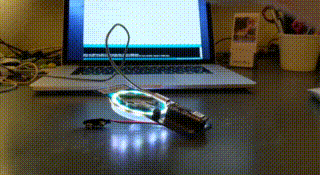

# Make Faire 2020 APDS9960 proximity sensor demo.

## Features
- Periodically read the APDS9960 proximity sensor
- Control the MK2020 badge lights accordingly

## Requirements 
Depends on the following Arduino libraries to be installed 
(Tools -> Manage Libraries -> Search)
- Adafruit_Neopixel
- Arduino_APDS9960
